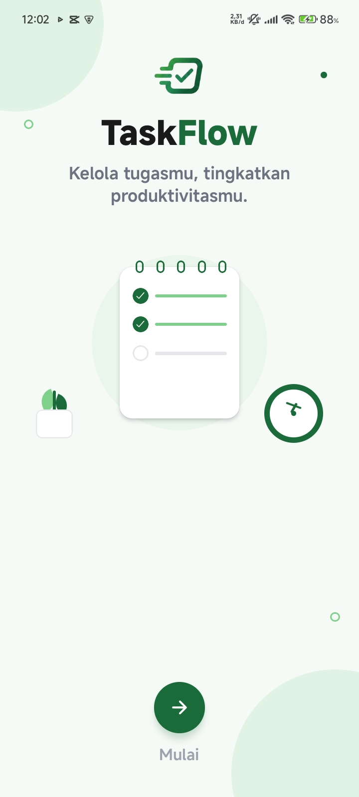
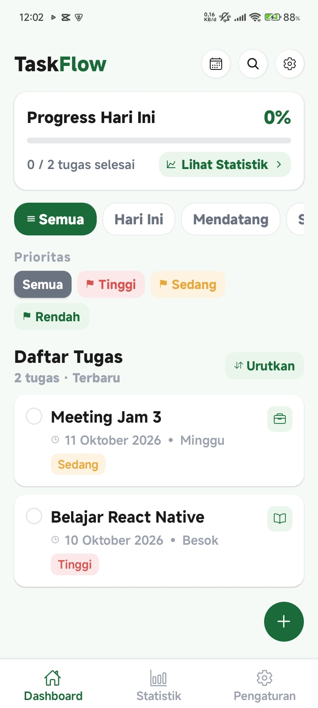
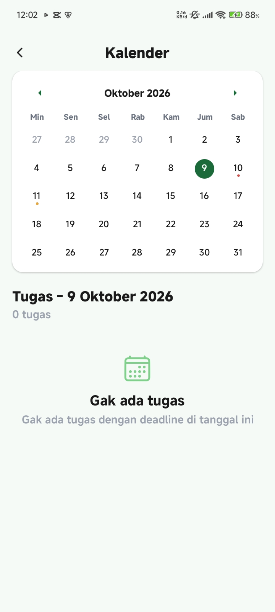
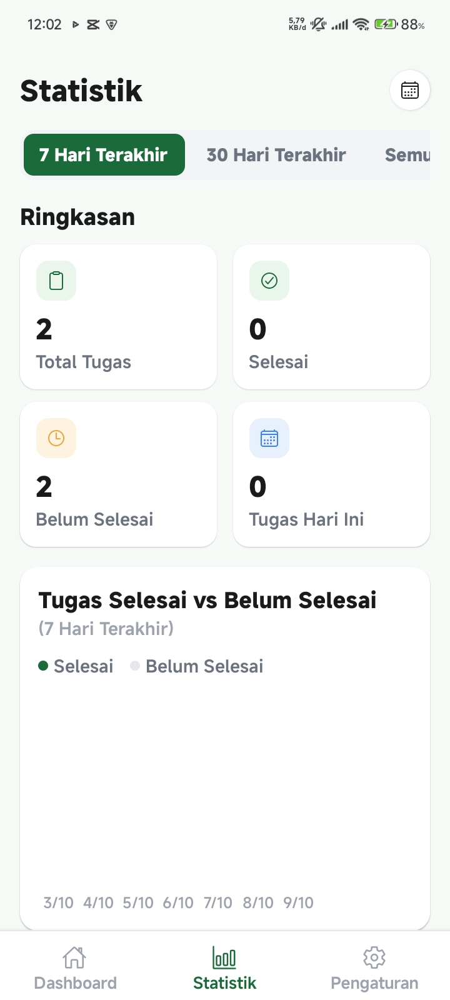
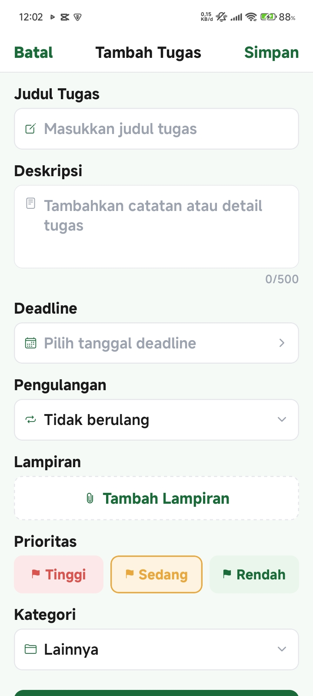
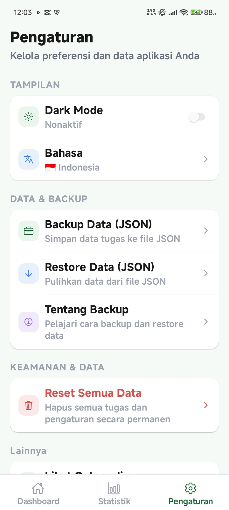

<div align="center">

# 📋 TaskFlow

### Aplikasi To-Do List Modern dengan Cloud Sync

[](https://expo.dev)
[](https://reactnative.dev)
[](https://supabase.com)
[](https://typescriptlang.org)
[](LICENSE)

**Kelola tugasmu, tingkatkan produktivitasmu.**

[Fitur](#-fitur) • [Screenshot](#-screenshot) • [Tech Stack](#️-tech-stack) • [Install](#-cara-install) • [Demo](#-demo)

</div>

---

## ✨ Fitur

### 📝 Task Management

- ✅ **Tambah, Edit, Hapus Task** — CRUD lengkap
- ✅ **Sub-task / Checklist** — pecah task jadi langkah kecil
- ✅ **Priority** — Rendah, Sedang, Tinggi dengan warna beda
- ✅ **Kategori** — Kerja, Pribadi, Belajar, Belanja, Kesehatan, Lainnya
- ✅ **Deadline** — tanggal + jam
- ✅ **Recurring Task** — harian, mingguan, bulanan
- ✅ **Attachment** — upload gambar / dokumen
- ✅ **Streak / Habit** — tracking kebiasaan

### 🔍 Search, Filter, Sort

- ✅ **Search** — cari task by judul/deskripsi/kategori
- ✅ **Filter** — by status, priority, kategori
- ✅ **Sort** — Terbaru, Terlama, Prioritas, Deadline, A-Z, Z-A

### 🔔 Notifikasi & Reminder

- ✅ **Reminder Otomatis** — notifikasi sebelum deadline
- ✅ **Custom Reminder** — 5 menit, 10 menit, 30 menit, 1 jam, 1 hari
- ✅ **Local Notification** — gak butuh internet

### 🎨 UI/UX

- ✅ **Dark Mode** — tema gelap
- ✅ **Multi-language** — 🇮🇩 Indonesia / 🇬🇧 English
- ✅ **Onboarding** — tour intro pertama kali
- ✅ **Haptic Feedback** — getar saat tap
- ✅ **Toast / Snackbar** — notifikasi kecil
- ✅ **Confirmation Dialog** — konfirmasi hapus
- ✅ **Loading Skeleton** — placeholder saat loading
- ✅ **Empty State** — tampilan kalo task kosong
- ✅ **Animasi** — smooth transitions
- ✅ **Pull to Refresh** — tarik ke bawah buat refresh

### ☁️ Cloud & Data

- ✅ **Supabase** — PostgreSQL + Auth + Storage
- ✅ **Anonymous Auth** — auto sign-in tanpa register
- ✅ **Multi-device Sync** — data sync ke semua device
- ✅ **Backup & Restore** — JSON file
- ✅ **Share Task** — share ke WhatsApp/email

### 📊 Statistik & View

- ✅ **Statistik** — chart bar + donut
- ✅ **Kalender View** — liat task per tanggal
- ✅ **Progress** — progress bar harian
- ✅ **Streak** — berapa hari berturut-turut

### 📱 Widget

- ✅ **Android Widget** — task di homescreen

---

## 📸 Screenshot

<div align="center">

| Welcome                                               | Home                                               | Kalender                                               |
| ----------------------------------------------------- | -------------------------------------------------- | ------------------------------------------------------ |
|  |  |  |

| Statistik                                               | Tambah Tugas                                               | Pengaturan                                               |
| ------------------------------------------------------- | ---------------------------------------------------------- | -------------------------------------------------------- |
|  |  |  |

</div>

---

## 🛠️ Tech Stack

| Komponen       | Tech                                 |
| -------------- | ------------------------------------ |
| **Framework**  | React Native + Expo SDK 54           |
| **Routing**    | Expo Router 6 (file-based)           |
| **Language**   | TypeScript 5.9                       |
| **Styling**    | React Native StyleSheet + NativeWind |
| **Backend**    | Supabase (PostgreSQL)                |
| **Auth**       | Supabase Anonymous Auth              |
| **Storage**    | Supabase Storage                     |
| **State**      | React Context API                    |
| **Notifikasi** | Expo Notifications                   |
| **Widget**     | react-native-android-widget          |
| **Chart**      | react-native-svg                     |
| **Kalender**   | react-native-calendars               |

---

## 🚀 Cara Install

### Prasyarat

- Node.js 18+
- npm / yarn
- Expo CLI
- Android Studio (buat build APK)

### Step 1: Clone Repo

```bash
git clone https://github.com/MuhammadReki/TaskFlow.git
cd TaskFlow
```
